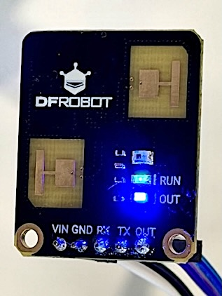

# c4002-python

[](https://github.com/nobudev7/c4002-python/actions/workflows/test.yml)
[](https://opensource.org/licenses/MIT)
[](https://www.python.org/downloads/)

Python driver and CLI tools for the **DFRobot C4002 (SEN0691) 24GHz mmWave Human Presence Detection Module**.

Provides robust UART packet framing, real-time telemetry decoding (static presence, motion distance, speed, direction, ambient light), automated room background noise calibration, and optional digital OUT pin monitoring on Raspberry Pi and other Linux systems.

---

> [!IMPORTANT]
> **Disclaimer**: This is an independent, community-developed open-source library. It is not affiliated with, maintained by, or endorsed by DFRobot. All product names, logos, and brands are property of their respective owners.

---



## Features

* **Complete Telemetry Decoding**: Parses 32-byte binary notification frames from the C4002 sensor.
  * **Static Presence**: Detects stationary humans (breathing, sitting) with distance (m) and signal energy (0–100).
  * **Motion Tracking**: Measures distance (m), speed (m/s), signal energy (0–100), and direction (Approaching / Away).
  * **Ambient Light**: Decodes onboard light sensor intensity (Lux).
  * **Gate Bitmasks & Hold Timers**: Reports active distance gates and presence disappearance countdown.
* **Auto Environmental Calibration**: Built-in routine to sample room reflections and store the background noise floor, preventing false triggers.
* **Reliable Checksum Verification**: Validates 16-bit packet checksums to reject corrupted data.
* **Hardware Agnostic**: Tested on Raspberry Pi Zero W / Pi 4 / Pi 5, but works with any standard USB-to-UART TTL serial converter on Linux, macOS, or Windows.
* **Optional GPIO Monitoring**: Support for the module's digital OUT pin via `RPi.GPIO` (falls back gracefully if GPIO is unavailable).

---

## Hardware Wiring

The C4002 operates at **3.6V – 5.5V** with **3.3V TTL UART logic**. It can be powered directly from the Raspberry Pi 5V power rail.

<!--  -->
```
  Raspberry Pi GPIO Header                  DFRobot C4002
 ┌─────────────────────────┐               ┌─────────────┐
 │ Pin 2  [5V]             ├───────────────┤ VIN         │
 │ Pin 6  [GND]            ├───────────────┤ GND         │
 │ Pin 8  [GPIO 14 / TXD]  ├───────────────┤ RX          │
 │ Pin 10 [GPIO 15 / RXD]  ├───────────────┤ TX          │
 │ Pin 11 [GPIO 17]        ├───────────────┤ OUT (opt)   │
 └─────────────────────────┘               └─────────────┘
```

### Pinout Table (Raspberry Pi 40-Pin Header)

| C4002 Pin | Raspberry Pi Pin | Header Pin # | Description |
| :--- | :--- | :--- | :--- |
| **VIN** | 5V Power | Pin 2 or 4 | Power supply (3.6V – 5.5V) |
| **GND** | Ground | Pin 6, 9, or 14 | Common ground |
| **TX** | GPIO 15 (RXD0) | Pin 10 | Sensor TX $\rightarrow$ Pi RXD |
| **RX** | GPIO 14 (TXD0) | Pin 8 | Sensor RX $\leftarrow$ Pi TXD |
| **OUT** *(Optional)* | GPIO 17 | Pin 11 | Digital presence indicator (HIGH = presence) |


### Raspberry Pi Serial Port Setup

Ensure the hardware UART is enabled and the serial login console is disabled:

1. Run `sudo raspi-config`
2. Navigate to **Interface Options** $\rightarrow$ **Serial Port**
3. "Would you like a login shell to be accessible over serial?" $\rightarrow$ Select **No**
4. "Would you like the serial port hardware to be enabled?" $\rightarrow$ Select **Yes**
5. Reboot the Raspberry Pi: `sudo reboot`

The primary serial port will be accessible at `/dev/serial0`.

---

## Installation

### From Source (Local Development)

```bash
git clone https://github.com/nobudev7/c4002-python.git
cd c4002-python
pip install -e .
```

To include optional Raspberry Pi GPIO support:

```bash
pip install -e ".[gpio]"
```

---

## Quick Start

```python
import time
from c4002 import C4002Sensor, TargetState

# Initialize sensor on default serial port and optional GPIO 17
sensor = C4002Sensor(port="/dev/serial0", baudrate=115200, out_pin=17)
sensor.connect()

try:
    while True:
        data = sensor.read_packet()
        if data and not getattr(data, "is_calibrating", False):
            print(f"State: {data.target_state_name} | Light: {data.ambient_light_lux} Lux")
            if data.presence_detected:
                print(f"  Presence: {data.presence_distance_m} m (Energy: {data.presence_energy}/100)")
                if data.target_state == TargetState.MOTION:
                    print(f"  Motion: {data.motion_distance_m} m at {data.motion_speed_m_s} m/s ({data.motion_direction_name})")
        time.sleep(0.5)
except KeyboardInterrupt:
    sensor.close()
```

Using as a context manager:

```python
with C4002Sensor(port="/dev/serial0") as sensor:
    data = sensor.read_packet()
    if data:
        print("Presence:", data.presence_detected)
```

---

## Environmental Background Noise Calibration

Because 24GHz radar waves detect micro-movements, reflective objects (metal furniture, fans, moving curtains) can cause false presence triggers in an empty room. 

The sensor features built-in automatic background noise calibration:

```bash
python3 examples/auto_calibrate.py
```

1. Run the script.
2. Step out of the room within 10 seconds.
3. Keep the room empty for 30 seconds while the sensor samples static background reflections and stores dynamic noise thresholds.

---

## Telemetry Data Reference

`sensor.read_packet()` returns a `TelemetryData` object with the following attributes:

| Attribute | Type | Unit / Range | Description |
| :--- | :--- | :--- | :--- |
| `target_state` | `TargetState` | Enum (`0`, `1`, `2`) | `NO_TARGET`, `STATIC_PRESENCE`, or `MOTION` |
| `target_state_name` | `str` | String | Human-readable state name |
| `presence_detected` | `bool` | `True` / `False` | `True` if state is presence or motion |
| `ambient_light_lux` | `float` | Lux (0.0 – 6553.5) | Onboard ambient light intensity |
| `presence_distance_m` | `float` | Meters | Distance to static presence target |
| `presence_energy` | `int` | `0` – `100` | Reflected signal energy of static target |
| `presence_countdown_s` | `int` | Seconds | Delay countdown before presence clears |
| `motion_distance_m` | `float` | Meters | Distance to moving target |
| `motion_speed_m_s` | `float` | m/s | Radial speed of moving target |
| `motion_energy` | `int` | `0` – `100` | Reflected signal energy of motion target |
| `motion_direction` | `MotionDirection` | Enum (`0`, `1`, `2`) | `AWAY`, `NO_DIRECTION`, or `APPROACHING` |
| `gate_bitmask` | `int` | Bitmask | Bit flags representing active distance gates |

---

## Running Unit Tests

Unit tests run without physical hardware using recorded raw telemetry packets:

```bash
# Using standard Python unittest
PYTHONPATH=src python3 -m unittest discover -s tests -p "test_*.py"

# Or using pytest (if installed)
PYTHONPATH=src pytest -v tests/
```

---

## References & Documentation

* [DFRobot C4002 Product Wiki (SEN0691)](https://wiki.dfrobot.com/sen0691)
* [DFRobot Official Arduino C4002 Library](https://github.com/DFRobot/DFRobot_C4002)

---

## License

This project is licensed under the [MIT License](LICENSE).
